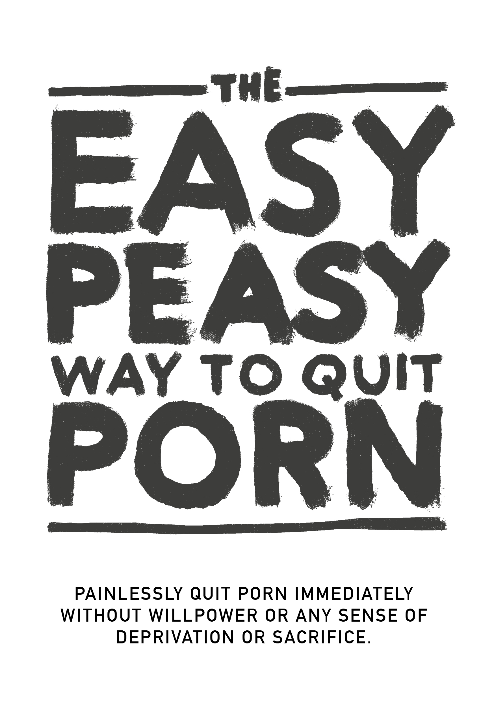

# Introduction

{width=45% height=45%}

[Audiobook](https://www.youtube.com/watch?v=ZktxO6adTnI) ([MP3](https://drive.google.com/file/d/1eU5mB7WXuknAMTgeITsF2MZmAEKG5aFE/view) | [MP3 (uncut)](https://1drv.ms/u/s!AnXDgZXI9WE5j9YGojB-crpKNyGeDw?e=aXyUrd))

DO NOT JUMP CHAPTERS

This open source book will enable you to stop using pornography immediately, painlessly, and permanently without willpower or any sense of deprivation or sacrifice. It won't place any judgement, embarrassment, or pressure to undergo painful measures.

In fact, there's absolutely no need to cut down or reduce your usage whilst reading; doing so is actually detrimental.

You might be apprehensive about the very thought, or one of the [millions](https://old.reddit.com/r/nofap) [actively](https://old.reddit.com/r/pornfree) [attempting](https://rebootnation.org) to [quit](https://yourbrainrebalanced.com). If so, perhaps what you've already read goes against everything you've ever been told, but ask yourself if what you've been told has worked? If it had, you wouldn't be reading this book at all.

Perhaps you identify with the following questions:

-   Do you spend far more time viewing porn than you originally intended?

-   Are you unsuccessful in efforts to stop or limit your consumption of pornography?

-   Has time spent viewing pornography interfered with, or taken precedence over personal or professional commitments, hobbies, or relationships in your life?

-   Do you go out of your way to keep your pornography consumption secret (e.g. deleting browser history, lying about viewing porn)?

-   Has viewing pornography caused significant problems in intimate relationship(s)?

-   Do you experience a cycle of arousal and enjoyment before and during pornography consumption, followed by feelings of shame, guilt, and remorse after?

-   Do you spend significant amounts of time thinking about pornography, even when not watching it?

-   Has viewing pornography caused any other negative consequences in your personal or professional life (e.g. missed work, poor performance, neglected relationships, financial problems)?

If you’re a porn user that depends on it for masturbation or sex *at all* and *for any reason*, all you need to do is read on.
If you're here for a loved one, all you need to do is persuade them to read this book.
But if unable to persuade them, read the book yourself. Understanding the method assists getting the message across and preventing your children from starting. Don't be fooled by the fact that they don't have access to it now -- all do before getting hooked.

## About the book {-}

This book is a rewritten version of a [rewrite](https://sites.google.com/site/hackbookeasypeasy
) of *Allen Carr's EasyWay to Smoking* for pornography, it's free and open source and licensed under CC-BY-SA. It's success rests on the foundation that you:

DO NOT JUMP CHAPTERS

When opening a combination lock, you have to enter the numbers in the right order. Addiction isn't any different.

Personally, the [original Google Sites version](https://sites.google.com/site/hackbookeasypeasy) (that wasn't written by me) changed my life. If you're anything like most people, you discovered porn when relatively young and have used it ever since. Until stumbling across the overwhelming -- yet somewhat censored -- literature warning of the dangers. Like myself, you've probably succeeded with streaks of various lengths, but have always eventually succumbed to illusory urges. I'm pleased to report this method works entirely differently, and has been the only method that has worked.

Or perhaps, you've been linked this book by a concerned party and are skeptical. Firstly, thank you for at least looking at it. This will be expanded upon shortly, but please briefly recall the first time you looked at pornography. Did you expect that you'd return to it for the rest of your life? According to my own informal studies on the matter (pestering friends to read this book), EasyPeasy is equally as effective for the casual porn user as it is for the heavily addicted. It's not terribly long, with high chances of large gains, so I beg you to continue reading.

The method described in this hackbook is:

-   Instantaneous.

-   Equally as effective for the heavy and casual user alike.

-   Causes no bad withdrawal pangs.

-   Needs no willpower.

-   Requires no shock treatment, aids, or gimmicks.

-   Won't cause you to replace this addiction with other addictions, such as overeating, smoking or drinking.

-   Permanent.

You might find this impossible to believe, but this sentiment is echoed by many people.

> *"This is the seminal work on porn addiction"*
>
> --- Some guy on reddit I can't find, don't think the pun was intentional.

> "*I was addicted for 10 years. Those 10 years I was crippled with depression, doubt, anxiety, and fear of my secret getting out. After every session, I hated myself, and after every porn diet I was back down the water slide in no time. However, this book helped me stop. I was always on the defensive against porn in the past. Now, after reading this book twice, I am on the offensive. Porn has no control over me and feels like a sad joke now.*"
>
> --- u/DeepNewt

> "*A few days ago, I turned 20 years old. For the first time in a very long time, I spent my birthday free from the porn trap, and it's all thanks to this book that I haphazardly stumbled upon only a few months ago. Before that, I had spent so much time trying to quit through traditional means, and I experienced so much inner turmoil and labeled myself permanently as an addict. The book solved all that for me. Where I previously feared I had no control over myself even when I'd unknowingly already beaten the little monster, I can now find pride in realising I don't need to be an addict anymore.*
>
> *I don't really have a reason for posting this, I just felt like I needed put this down somewhere other than inside my head because it means so much to me. If you're reading this and are thinking about reading or recommending the book, take it from me that it works better than any other method out there. My biggest tip is to take notes, which sounds funny, but it really helped me solidify certain ideas.*"
>
> --- u/Suspicious_Web_4594

> "*based*"
>
> --- anon, /fit/

## Warning

If you're expecting this book to ‘scare’ you into quitting using the various health issues users risk, such as sexual dysfunction (including porn-induced erectile dysfunction), unreliable arousal, loss of interest in real sex partners, brain hypofrontality, and the blinding accusation that it's a filthy, disgusting habit and *you* are a stupid, spineless, weak-willed jellyfish, you’ll be sorely disappointed. Those tactics never helped me to quit and if they were going to help you, you'd have quit already.

Conventional methods of quitting advocate using willpower, or ‘porn-diet’ substitution methods such as ‘using once every *n* days’ and cutting down consumption. Some sites list peer-reviewed research about neurotransmitters and neuroplasticity, and while these sites are informative, many are aware of the health risks and choose to do nothing, though such material is typically avoided. Ultimately, they are equally ineffective as they don't actually remove the reasons for using porn. Ultimately, turning something into a forbidden fruit isn't how you treat addiction.

This method, referred to as EasyPeasy, works differently. Some of the things about to be said might be difficult to believe, but by the time you've finished this book, you’ll not only believe them, you’ll wonder how you could have ever been brainwashed into believing otherwise.

There's a common misconception that we choose to watch porn. Porn addicts (yes, addicts) no more choose to watch porn than alcoholics choose to become alcoholics, than heroin addicts choose to become heroin addicts. It's true that we choose to boot up the laptop or smartphone, fire up the browser, and visit our favorite ‘online harem’. Occasionally I choose to go to the cinema, but I certainly didn't choose to spend my whole life in the cinema theatre. Originally, curiosity and human nature took me there, but I wouldn't have started had I known I'd become addicted, causing the decline of my health, happiness, and relationships. *“If only I'd heard about sexual dysfunction on my first visit to that porn site!”*

Take a moment to reflect, did you ever make the ‘positive’ decision that you must/need porn to masturbate? Or that you should/must/need porn-induced fantasies to spice up sex with your partner? Or, that at certain times in your life, you couldn't enjoy a good night's sleep or perhaps even pass an evening after a hard day at work without surfing for porn? Or that you couldn't concentrate or handle stress without it? At what stage did you decide that you *needed* porn, that you *needed* it permanently in your life, feeling insecure, even panic-stricken without porn, without your online harem?

Like every other porn user, you have been lured into the most sinister and subtle trap that man and nature have ever combined to devise. There's not a person alive, whether a user themselves or not, that likes the thought of their children using porn to cope or for pleasure. This means that all addicts wish they had never started. That's unsurprising: no one needs porn to enjoy life or cope with stress before they get hooked.

At the same time, all users wish to continue to use. After all, nobody forces us to launch our browser's incognito mode. Whether they understand the reason or not, it's only users that decide to knock on the doors of their online harems.

If there were a magic button the user could press to wake up the following morning as if they'd never accessed their first tube site, the only addicts tomorrow would be young people still ‘experimenting’.

The only thing that prevents us from quitting is **FEAR!** Fear caused by the belief that we’ll have to survive an indeterminate period of misery, deprivation, and unsatisfied craving in order to be free from porn. These spawn from irrational beliefs, both learned and acquired, such as:

-   Masturbation or sex leading to orgasm is the *only* and *most* important thing in life.

-   Porn is ‘safer’ than real-life sex because porn can't reject me.

-   Porn is educative and useful.

-   Entitlement to a ‘superior’ sex experience.

-   More is always better.

These irrational beliefs spawn irrational consequences when acted upon, including:

-   Worshipping and obsessing when a ‘perfect 10/10’ is found.

-   Perceiving yourself as a loser if you miss out on sex, as if it's the most important thing in the human experience.

-   Holding out for a perfect 10.

-   Being excessively judgmental and critical of prospective partners.

-   Forcing yourself to have sex whether you want it or not.

It's fear that a night all by yourself will be miserable, spent fighting uncontrollable impulses. Fear that the night before exams will be a night from hell without porn. Fear that we’ll never be able to concentrate, handle stress, or be as confident without our little crutch and that our personality and character will change.

But most of all, fear that ‘once an addict, always an addict’: that we’ll never be completely free, spending the rest of our lives craving the occasional porn-induced orgasm at odd times. If, as I did, you've already tried all the conventional ways to quit and have been through the misery and torture of the ‘willpower method’, you’ll not only be affected by that fear, you’ll be convinced you can never quit.

If you’re apprehensive, panic-stricken, or feel that the time is not right for you to quit, let me assure you that your apprehension and panic isn't relieved by porn — it's caused by it. You didn't decide to fall into the porn trap, but like all traps, it's designed to ensure that you remain trapped. Ask yourself, when you viewed those first porn pictures and videos, did you decide to come back to view them as long as you live? So when will you quit? Tomorrow? Next year? Stop kidding yourself! The trap is designed to hold you for life. Why else do you think all these other addicts don't quit before it ‘kills’ their lives?

I've referred to a magic button; EasyPeasy works just like that magic button. Let me make it quite clear, EasyPeasy isn't magic, but for myself and others who've found it so easy and enjoyable to quit, it seems like it!

The warning is as follows:
This is a chicken and egg situation: every addict wants to quit and every addict can find it easy and enjoyable to quit. It's only **fear** that prevents users from attempting to quit. The single greatest gain is to be rid of that fear, but you won't be free of that fear until you complete the book. On the contrary, your fear may increase as you continue reading, which might prevent you from finishing it. Take this comment from one woman.

***“I've just finished reading EasyPeasy. I know that it's only been four days, but I feel so great, I know that I’ll never need to use porn again. I first started to read your book five months ago, got half way through and panicked. I knew that if I went on reading I would have to stop. Wasn't I silly?”***

You didn't decide to fall into the trap, but be clear in your mind: you won't escape from it unless you make the affirmative decision to do so. You may already be straining at the leash to quit, or you may be apprehensive about the very thought, but either way, please bear in mind: **YOU HAVE NOTHING TO LOSE!**

If at the end of the book you decide that you wish to continue to use porn for masturbation or sex, there's nothing to prevent you from doing so. You don't even have to cut down or stop using porn whilst reading the book, and remember, there is no shock treatment. On the contrary, I have only good news for you. Can you imagine how Andy Dufresne felt when he finally escaped from Shawshank Prison? That's how I felt when I escaped from the porn trap, and that's how the ex-users who've used EasyPeasy feel. By the end of the book, that's how you’ll feel! Go for it!

## Finally... {-}

Everyone can find it easy and enjoyable to quit porn, including you! All you have to do is read the rest of this book with an open mind; the more you understand, the easier it will be. Even if you don't understand a word, provided you follow instructions, you’ll find it easy. Most importantly, you won't go through life moping for porn or feeling deprived, and by the end of the book the only mystery will be why you did it for so long.

With EasyPeasy, there are only two reasons for failure.

**Failure to carry out instructions.**
Some will find it annoying that the book is so dogmatic about certain recommendations, such as not to try cutting down or using substitutes. I certainly don't deny that there are many who have succeeded in stopping using such ruses, but they've succeeded in *spite of* and not because of them. Some people can make love standing on a hammock, but it isn't the easiest way. The numbers for opening this trap's lock are in this book, but they need to be used in the correct order: going from one chapter to the next and not skipping chapters.

**Failure to understand.**
Don't take anything for granted, question not only what you’re told, but your own views and what society has told you about sex, internet porn, and addiction. For example, those who believe it's just a habit, ask yourself why other habits — some of which are enjoyable — are easy to break, while a habit that feels awful, costs energy, time and virility is so difficult to break. Those that believe you enjoy porn, ask yourself why other things that are infinitely more enjoyable you can take or leave. Why do you *have* to have porn, panic setting in if you don't?

EasyPeasy is about to give you the knowledge on how easy and enjoyable it is to quit porn. Like many others, one of my greatest triumphs in life has been escaping the porn trap. There's no need to feel depressed, on the contrary, you’re about to accomplish something that every user on the planet would love to achieve: **FREEDOM!**

**REMEMBER, DO NOT SKIP CHAPTERS.**

Some terms before you begin:
***PMO***: The cycle of porn, masturbation, and orgasm.
***Online harem***: Websites hosting high-speed internet porn.

## Tips for reading, and final minor notes

**Don't read this book like a normal book**, it's very short, and you should be able to finish it within a couple of hours. Most people benefit from *highlighting or taking notes*, and usually recommend **rereading** it a few times to fully solidify the lessons.

Why the hackbook? Because Allen Carr has long since passed away and the institutions he's formed don't list internet pornography as one of the addictions they provide treatment for. I don't gain monetarily or otherwise.

Throughout this book, myself, the original Hackauthor, and Allen Carr will appear transparently in order to provide you with a unique and compelling method to easily and painlessly quit.

**Hackbook:** A book based and hacked from another book. The original author is fully credited. 

A number of communities exist for the hackbook as well, but would recommend checking them out only after you've finished reading the book.

[urbit](https://urbit.org) - ~mislyr-midnyt/coomer (now actually working!! best possible contact method, use this pls) | [coomer meme archive](https://coomer.org) | [analytics](https://plausible.io/easypeasymethod.org) | [matrix](https://matrix.to/#/!xmJZznbJXuwzEGSEti:matrix.org?via=matrix.org) | [discord](https://discord.com/invite/bCXEnf9) | [reddit](https://reddit.com/r/pmohackbook) | [feedback form](https://forms.gle/p7cTxowaNpKqgi5Z7)

Quick reminder: **DO NOT JUMP CHAPTERS**

I'd wish you luck, but as you'll soon come to learn, you don't need it.

Good vibes,

Hackauthor²

{width=88 height=31}

This work is licensed under a [Creative Commons Attribution-ShareAlike 4.0 International License](https://creativecommons.org/licenses/by-sa/4.0/). Code is [GPLv3](https://gitlab.com/snuggy/easypeasy/-/blob/master/LICENSE).
