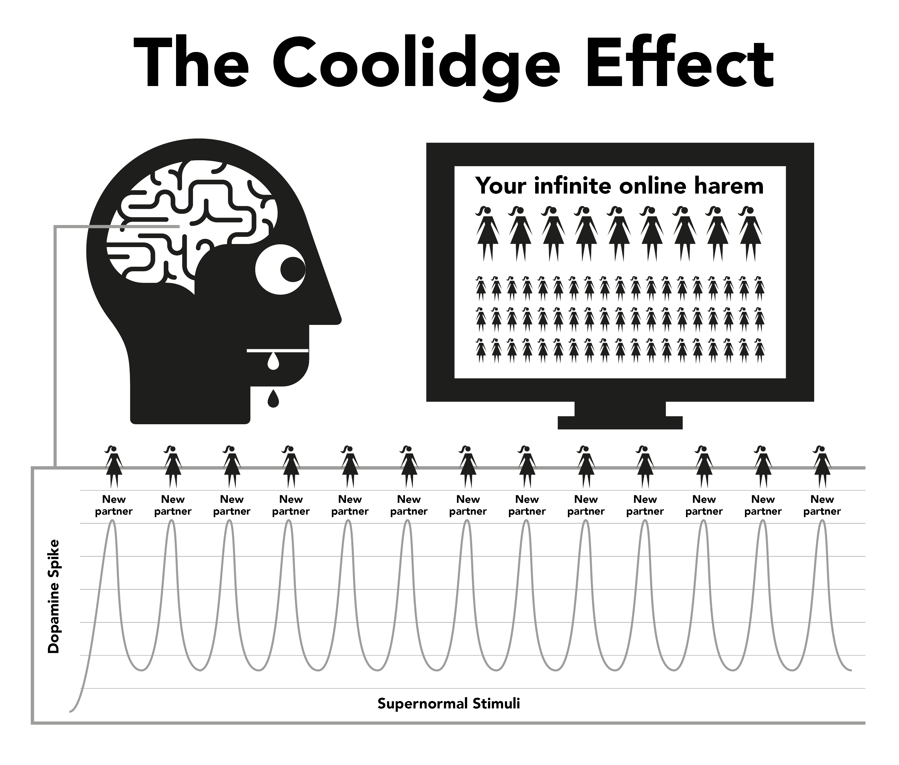

# Nature

Internet porn works through hijacking natural reward mechanisms designed to keep you reproducing for as long as possible. Internet porn's instant and highly accessible form keeps the brain's reward mechanism producing dopamine for significantly longer than normally possible. Scientifically, this is called the Coolidge effect, which you might already be aware of.

Dopamine is a neurotransmitter associated with feelings of wanting, with actual pleasure produced by opioids. More dopamine, more opioids and more action. Without dopamine, actions such as eating don't feel pleasurable and aren't completed, with high fat and sugar foods producing the highest chemical release.

Dopamine is also released in response to novelty. With a seemingly infinite amount of pornography available this floods the limbic system (reward circuit), so the first time you see porn you act, orgasming and triggering another flood of opioids. Incentivised to get as much dopamine as possible, the brain stores this as a script for easy recall and strengthens neural pathways through the release of a chemical called DeltaFosB. Now, the brain calls up these pathways in response to cues such as sexy commercials, alone time, stress or even feeling a little down and suddenly you’re ready to take a ride on the ‘water slide’. Every time this is repeated, more DeltaFosB is released so the water slide is greased, alive and easier to ride down the next time.

The limbic system has a self correcting system to trim the number of dopamine and opioid receptors when frequent and daily flooding of dopamine is detected. Unfortunately, these receptors are also needed to keep us motivated to handle daily life stresses. Nominal amounts of dopamine produced by natural rewards simply don't compare to pornography and aren't as efficiently absorbed by the decreased receptors, leading you into feel more stressed and irritated than normal. This process is known as desensitisation.

In this cycle you crossed the ‘red line’ and triggered emotions such as guilt, disgust, embarrassment, anxiety and fear, which in turn raise dopamine levels even higher and cause the brain to misinterpret these feelings as sexual arousal.

As time passes, not only is the brain desensitised to previous clips it's seen, but also similar genres and shock level. This lower motivation triggers feelings of lower satisfaction as our brains engage in constant rating, pushing you to find clips to satisfy the hunger. So you seek more novelty, clicking on the amateurish, shock inducing clip on the homepage you confidently said you wouldn't on your first visit.

> *“For in the dew of little things the heart finds it's morning and is refreshed"*
>
> --- Kahlil Gibran

A fleeting feeling of security is all that's needed to get through a rough spot in life, but will your desensitised brain be able to catch that drop of destresser that a non-user’s brain is able to use?

Dopamine flooding acts like a quick acting drug, falling quickly and inducing withdrawal pangs. Many users have the illusion these pangs are the terrible trauma they suffer when trying or being forced to stop. In fact, they’re primarily mental since the user is feeling deprived of their pleasure or prop.

## The Little Monster

The actual chemical withdrawal from porn is so subtle that most users have lived and died without realising they’re drug addicts. Many users have a fear of drugs, yet that’s exactly what they are, drug addicts. Fortunately it’s an easy drug to kick, but you first need to accept that you are, in fact, addicted. Withdrawal from porn doesn’t cause any physical pain and is merely an empty, restless feeling of something missing, which is why many believe it’s something to do with sexual desire. Prolonged, this feeling becomes nervousness, insecurity, agitation, low confidence and irritability. It’s like hunger, for a poison.

Within seconds of engaging in a session, dopamine is supplied and the craving ends, resulting in a feeling of fulfillment as you whiz down the water slide. In the early days, withdrawal pangs and their subsequent relief are so slight we’re unaware of them. When we become regular users, we believe it’s because we’ve come to enjoy them or gotten into the ‘habit’. The truth being that we’re already hooked but don’t realise it. The little monster is already in our brains, so every once and a while we take trips down the water slide to feed it.

All users begin seeking porn for irrational reasons. The *only* reason anybody continues using porn, whether they’re a casual or heavy user, is to feed that little monster. The whole conundrum is a series of cruel and confusing punishments, but perhaps the most pathetic aspect is the sense of enjoyment a user gets from a session, trying to get back to the sense of peace, tranquility and confidence their body had before becoming hooked in the first place.

## The Annoying Alarm

You know that feeling when a neighbour’s home alarm has been ringing all day — or some other minor persistent aggravation — then the noise suddenly stops and marvellous feelings of peace and tranquility wash over you? This isn’t really peace, but the ending of an aggravation. Before starting the next session our bodies are complete, but then we begin forcing our brains to pump dopamine and when we’re done and it begins to leave, we suffer withdrawal pangs. These aren't physical pain, merely an empty feeling. We aren't even aware it exists but it’s like a dripping tap inside our bodies.

Our rational minds don’t understand it, but they don’t need to. All we know is that we want porn and when we masturbate the craving goes. However, the satisfaction is fleeting because in order to relieve the craving more porn is required. As soon as you orgasm, the craving starts again and the trap continues to hold you. A feedback loop, unless you break it!

The porn trap is similar to wearing tight shoes just to obtain the pleasure of taking them off. There are three primary reasons why users can’t see it this way.

1.  From birth, we’ve been subjected to massive amounts of brainwashing telling us internet porn is simply another modern development that replaced the print version of porn. This fallacy is packaged with the truth that masturbation isn’t harmful, so why shouldn’t we believe them?

2.  Because physical dopamine withdrawal involves no actual pain, merely an empty insecure feeling inseparable from hunger and normal stress, this feeling manifests into a porn session as those are the very times we tend to seek internet porn. We tend to regard this feeling as normal.

3.  However, the primary reason users fail to see internet porn in its true light is due to it working back to front. It’s when you’re *not* consuming it that you suffer the empty feeling. Because the process of getting hooked is incredibly subtle and gradual in the early days, the empty feeling is regarded as normal and so isn’t blamed on the previous session. The moment the browser is fired up and you begin your session, you get an immediate boost and become less nervous or more relaxed, so internet porn gets the credit.

This ‘back to front’ reverse process makes all drugs difficult to kick. Imagine the state of panic of a heroin addict without any heroin; now picture their utter joy when they can finally plunge a needle into their vein. People who aren't addicted to heroin don’t suffer that panicked feeling.

The heroin doesn’t relieve the feeling, it causes it. Similarly, non-users don’t suffer empty feelings of needing internet porn, or panic when they’re offline. Non-users can’t understand how users possibly obtain pleasure from two-dimensional videos with muted sounds and abnormal body proportions. Eventually, users can’t understand either.

We talk about internet porn being relaxing or satisfying, but how can you be satisfied unless you were dissatisfied in the first place? A non-user doesn’t suffer from this unsatisfied state, completely relaxed after a no-sex date, while the user isn’t until they’ve satisfied their ‘little monster’.

## A pleasure or a crutch?

An important reminder — the main reason that users find it difficult to quit is due to the belief they’re giving up a genuine pleasure or crutch. It’s essential to understand that you’re giving up *absolutely nothing* whatsoever. The best way to understand the subtleties of the porn trap is comparing it with eating. The habit of regular meals causes us to not feel hungry between, only aware of hunger if the meal is delayed. There’s no physical pain, just an empty insecure feeling recognised as hunger. The process of satisfying our hunger is a very pleasant experience.

Pornography appears to be almost identical, but it’s not. Like hunger, there’s no physical pain and the reward mechanism behaves in similar ways, but it’s this similarity to eating that tricks the user into believing there’s a genuine pleasure or crutch. Although eating and porn appear to be very similar, in reality they’re exact opposites.

-   You eat to survive and energise your life, whereas porn dims and cuts down your mojo.

-   Food genuinely tastes good and eating is a genuinely pleasant experience that we enjoy throughout our lives. Porn involves self-sabotaging the happiness receptors and thus destroys your chances to cope and feel happy.

-   Eating doesn’t create hunger and genuinely relieves it, whereas the first porn session starts the craving for dopamine and each subsequent session. Far from relieving it, it ensures suffering for the rest of your life.

Is eating a habit? If you think so, try breaking it completely! To describe eating as habit would be like describing breathing as a habit — both are essential for survival. It’s true that people have the habit of satisfying their hunger at different times with varying types of food, but eating itself isn’t habit. Neither is porn. The only reason a user fires up the browser is trying to end the empty feelings the previous session created, at different times with varying escalating genres.

On the internet, porn is frequently referred to as a habit and for convenience EasyPeasy also refers to the ‘habit’. However, be constantly aware that porn isn’t habit, it’s **drug addiction!** When we start to use porn, we have to force ourselves to cope with it. Before we know it, we’re escalating into increasingly bizarre and shocking porn. The thrill is in the hunting, not the killing, with dopamine rapidly leaving the body after orgasm, explaining why users want to ‘edge’ (delaying orgasm) through flicking between multiple browser windows and tabs.

## Crossing the red line

As with any other drug, the body tends to develop immunity to the effects of the same old clips, our brain wanting more or something else. After short periods of watching the same clip it ceases to completely relieve the withdrawal pangs that the previous session created. There’s a tug of war occurring in this porn paradise: you want to stay on the safe side of your ‘red line’, but your brain is asking you to click on the forbidden-fruit clip.

You feel better after engaging in this porn session, but you’re more nervous and less relaxed than someone who never started, even though you’re living in a supposed porn paradise. This position is even more ridiculous than wearing tight shoes because as you go through life an ever-increasing amount of discomfort remains after taking the shoes off. Because the user knows the little monster has to be fed, they themselves decide the time, which tends to be on four types of occasions or a combination of them:

Boredom / Concentration — Two complete opposites!  
Stress / Relaxation — Two complete opposites!

What magic drug can suddenly reverse the very effect it had minutes before? The truth is that porn neither relieves boredom and stress nor promotes concentration and relaxation. If you think about it, what other types of occasions are there in our lives, bar sleep? If you have ideas of toning down to other types of ‘realistic’ or ‘soft’ genres of porn, please note that the content of this book applies to all porn — print, webcams, pay-per-view, chat, live shows, etc. The human body is the most sophisticated object on the planet, but no species, even the lowest amoeba or worm, survives without knowing the difference between food and poison.

Through natural selection our minds and bodies have developed techniques for rewarding actions that multiply and sustain humanity. They’re not prepared for supernormal stimuli that are bigger, brighter and edgier than anything found in nature, since even the most muted two-dimensional image causes us to become aroused. But repeatedly look at the same image and you won’t be. In real life, checks and balances ensure you do something else but internet porn has no such limiter, causing you to spend your life in a virtual harem!

It’s a fallacy that physically and mentally weak people become users, the lucky ones being those who found their first instance repulsive and are cured for life. Alternatively, they aren’t mentally prepared to go through the severe learning process of fighting to get themselves hooked, fears of ‘getting caught’ or not being technical enough to operate browser privacy settings. Perhaps the most tragic part of the whole business relates to teenagers — skilled in finding material and covering their tracks — who start in increasing number.

Enjoying internet porn is an illusion. Jumping from genre to genre, merely keeping our novelty ‘monkey’ within the ‘red line’ of ‘safe’ porn genres in order to get our dopamine fix. Like heroin addicts, all they’re really enjoying is the ritual of relieving those pangs.

## The High From the Dance Around The Red Line

Even with the one clip that’s lingered on, users constantly teach themselves to filter out the bad and ugly portions of porn clips. Even if it’s solo, they still filter on the body parts that appeal to them the most. In fact, some take pleasure in this dance around the red line, finding excuses to declare they like the ‘soft stuff’ and are unaddicted to supernormal stimuli. But ask a user who believes they stick to a certain actor or genre, *“If you cannot get your normal brand of porn and can only obtain an unsafe genre, do you stop masturbating?"*

No way! A user will masturbate to anything, escalating genres, differences in sex orientation, look-alike performers, dangerous settings, shocking relationships, anything to sate the little monster. To begin with they taste awful, but given enough time you’ll learn to enjoy them. Users will seek empty fulfillment after having real sex, after a long work day, fever, colds, flu, sore throats and even during admittance in hospitals.

Enjoyment has nothing to do with it; if sex is wanted, it makes no sense to be with your laptop. Some users find it alarming to realise they’re drug addicts and believe this will make it even more difficult to stop. In fact, this is good news for two important reasons.

1.  The reason why most continue using is because although we know the disadvantages far outweigh the advantages, we believe there’s something in porn that we actually enjoy or that it acts like some sort of prop. We’re under the illusion that after we stop using there will be a void, certain situations in our lives never being quite the same. In fact porn not only provides nothing, it subtracts.

2.  Although internet porn is the most powerful trigger for novelty and sex-based dopamine-flooding, because of the speed you become hooked, you’re never badly hooked. The actual withdrawal pangs are so mild that most users have lived and died without realising they’ve suffered them.

Why is it then that many users find it so difficult to stop, going through months of torture and spending the rest of their lives pining for it at odd times? The answer is the second reason, brainwashing. The neurotransmitter addiction is easy to cope with, most users going for days without online porn on business trips or travel, unaffected by withdrawal pangs. Their little monster is safe in the knowledge you’ll open your laptop as soon as you return to your hotel room. You can survive your obnoxious client and your megalomaniac manager, knowing the fix is there for your taking.

## The Smokers Analogy

A good analogy is that of the cigarette smoker. If they went ten hours of the day without a cigarette they’d be tearing their hair out, but many smokers will buy a new car and refrain from smoking in it. Many will visit theatres, supermarkets, churches and being unable to smoke causes them no problems. Even on trains and airplanes there have been no riots. Smokers are almost pleased for someone or something to stop them smoking.

Users will automatically refrain from using internet porn in their parents’ home during family gatherings and other events with little discomfort. In fact, most users have extended periods during which they abstain without effort. The neurological little monster is easy to cope with even when you’re still addicted. There are millions of users who remain casual users all their lives and they’re just as addicted as the heavy user. There are even heavy users who’ve kicked the addiction but have an occasional peek, greasing the water slide to be ridden down at the next dip in mood.

As said previously the actual porn addiction isn’t the main problem, it's simply acting as a catalyst to keeping our minds confused over the real problem – brainwashing. Don’t think the bad effects of internet porn are exaggerated, however; if anything, they’re sadly understated. Occasionally, rumours circulate that the neural pathways created are there for life, with the right mix of chance and stimulus sending you down the life-ruining water slide again, but these are untrue. Our brains and bodies are miraculous machines, recovering within a matter of weeks.

It’s never too late to stop! A quick browse of online communities will show you people of all ages rebooting their (and their partner's) lives. As with anything, some do take it to the next level, practicing semen retention, Karezza and through differentiation of the sensory and propagative sides of sex make their partners happier than ever before.

It may be of consolation to lifelong and heavy users that it’s just as easy for them to stop as casual users, and in a peculiar way it’s easier. The further it drags you down, the greater the relief. When I stopped I went straight to *zero* and didn’t have one bad pang. In fact, the process was actually enjoyable even during the withdrawal period.

But first, we must remove the brainwashing.
