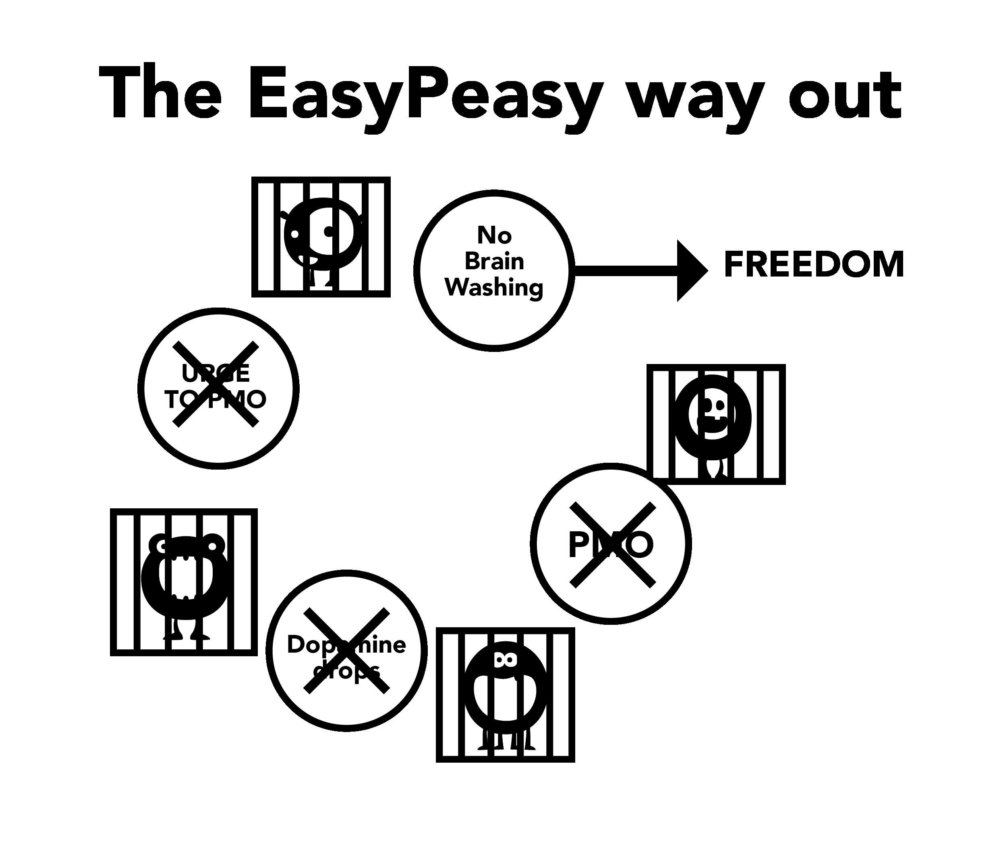

# Brainwashing Aspects

The porn trap's big monster is bred through the culmination of many aspects, including societal forces, media portrayals, peers and the user's own internal narrative. Failure to deconstruct these fallacies whilst using the willpower method eventually leads to feelings of deprivation, leading the user back into the trap. Deconstruction of the imagined value of porn is crucial for success and allows you to see where you’re being robbed!

Of importance to note is the link between brainwashing and fear. It's fear of feeling ***future withdrawal pangs*** that create the pangs. Fear is the pang itself. Think about when you've had withdrawal symptoms such as sweaty palms, shortness of breath, sleeping problems and an inability to think straight. Now think of similar situations when you've had those feelings: job interviews, nerves around an attractive person, public speaking, etc. These are the same anxious feelings the fear causes. Simply put, how can a physical drug still hook people months after stopping? It must be mentally, correct?

## Stress

Not only great tragedies in life, but also minor stresses drive users into the forbidden ‘unsafe' area previously excluded. Stresses include socialising, phone calls, anxieties of the housewife with young children, and many others. Let's take phone calls as an example, particularly for a businessperson. Most calls aren't from satisfied customers or your boss congratulating you, there's some sort of aggravation. Coming home to mundane family life of kids screaming and their partner's emotional demands causes the user — if they aren't already doing so — to fantasise the relief of porn promised that night. They unconsciously suffer withdrawal pangs, destressors weakened and unprepared for additional aggravation. Partially relieving the pangs at the same time as normal stress, the total is reduced and the user gets a temporary boost. The boost isn't an illusion, the user does genuinely feel better than before, but they’re more tense than they would be as a non-user.

The following example isn't designed to shock you — EasyPeasy promises no such treatment — but is to emphasise that porn destroys your nerves rather than relaxing them.

Try to imagine getting to the stage where you’re unable to be aroused, even with a very sexy and attractive partner. For a moment, pause and try to visualise life where a very lovely and charming person has to compete and fail with the virtual porn stars occupying your ‘harem’ to get your attention. Imagine the frame of mind of a person who, when issued with that warning, continues using and dies without ever having real sex with this charming and willing partner. It's easy to dismiss these people as weirdos, but stories like these aren't fakes — this is what the awful novelty of the porn drug does to your brain. The more you go through life, the more courage is sapped and the more you’re deluded into believing porn is doing the opposite.

Have you ever been overtaken by panic when out of the blue the WiFi stops working or is too slow? Non-users don't suffer from it, as internet porn *causes* that feeling. As you go through life, it systematically destroys your nerve and courage, leaving DeltaFosB to form powerful neural water slides in its wake, progressively destroying your ability to say no. By the stage where virility has been killed, the user believes porn is their new partner and is unable to face life without it.

*Internet porn isn't relieving your nerves, it’s slowly destroying them*. One of the great gains of breaking the addiction is the return of your natural confidence and self-assurance.

There's no need to rate yourself on your ability to satisfy a partner — this isn't freedom. But this freedom cannot be obtained by continuing to grease the dopamine water slide in ways that undercut your happiness and libido by repeating the same destructive behaviour.

## Boredom

If you’re like many people, as soon as you climb into bed you’re already on your favorite porn site, probably already forgetting until reminded. It's become second nature. Similarly, porn relieving boredom is another fallacy because boredom is a frame of mind, occurring when you've been deprived for a long time or are trying to cut down.

The actual situation is this, when you’re addicted to the supernormal pull of internet porn and then try to abstain, it feels like there's something missing. If you have something to occupy your mind that isn't stressful, you can go for long periods of time without being bothered by the absence of the drug. However, when you’re bored there's nothing to take your mind off it, so you feed the monster. When you’re indulging yourself and not trying to stop or cut down, even firing up private browsing becomes subconscious. This ritual is automatic; if the user tries to remember sessions during the last week, they're only able to remember a small proportion of them, like the very last one or the session after a long abstinence.

The truth being that porn increases boredom indirectly because orgasms make you feel lethargic and instead of undertaking an energetic activity, users tend to prefer lounging around, bored and relieving their withdrawal pangs. Countering the brainwashing is important because users tend to view porn when bored, our brains wired to interpret porn as interesting. Similarly, we've also been brainwashed into believing sex — even bad sex — aids relaxation. It's a fact that when sad or under stress, couples want to have sex. In the absence of discrimination between tantric and propagative sex, watch how quickly you want to get away from each other after the mandatory orgasm is achieved. If the couple had just decided to hug, speak or cuddle and go to sleep, they'd have felt relieved.

## Concentration

Masturbation and sex don't help concentration — when you’re trying to concentrate you automatically try and avoid distractions. Therefore, when a user wants to concentrate, they don't even think — automatically opening the browser, feeding the little monster and partially ending the craving. They get on with the matter at hand, already forgetting they’ve viewed porn. After years of dopamine-flooding the neurological changes affect abilities such as accessing information, planning and impulse control.

You’re also driven to provide novelty for the next session as the same stuff no longer generates enough dopamine and opioids. So you’ll have to roam the internet streets for novelty, fighting the pull to cross the line towards shocking material, which in turn generates more stress and leaves you unfulfilled after finishing.

Concentration is also adversely affected as the dopamine receptors are culled due to natural tolerance to the large surges, reducing the benefit of smaller dopamine boosts from natural destressors. Your concentration and inspiration will be greatly boosted as this process is reduced. For many, it's the concentration aspect that prevents them from succeeding with the willpower method: they could put up with the irritability and bad temper, but the failure to concentrate on something difficult once their crutch is removed ruins many.

Loss of concentration that users suffer when trying to escape isn't due to the absence of sex, let alone porn. You have mental blocks when you’re addicted to something and when you have a mental block, what do you do? You fire up the browser — which doesn't cure the block — so then what do you do? You do what you have to do, getting on with it just as non-users do.

When you’re a user nothing is blamed on the cause: users never have *sexual dysfunction*, just occasional downtime. The moment you stop using, everything that goes wrong is blamed on the reason you stopped. Now when you have a mental block, instead of just getting on with it, you begin to say "*If only I could check my harem now, it would solve all my problems*". You then begin to question your decision to quit and escape from the slavery.

If you believe that porn is a genuine aid to concentration, worrying about it will guarantee that you'll be unable to concentrate. Doubt, not the physical withdrawal pangs, creates the problem. Always remember, it's the user who suffers pangs, not non-users.

## Relaxation

Most users think that porn helps them to relax. It doesn't. The frantic search to get the fix in those ‘dark alleys of the internet’ and the internal struggle of straining at the leash to cross the red line certainly doesn't *sound* like a very relaxing activity.

As night rolls in after a trip to a new place or a long day, we sit down to relax, relieving our hunger, thirst and are completely satisfied. The user is not, as they have another hunger to satisfy. Users think of porn as the icing on the cake, but in actuality it's the ‘little monster’ that needs feeding. The truth is that the addict can never be completely relaxed and going through life it gets exponentially worse. Take one online comment from an ex-user:  

> "*I really believed that I had an evil demon in my make up, I now know that I had, however it wasn’t some inherent flaw in my character but the little internet porn monster that was creating the problem. During those times I thought I had all the problems in the world, but when I look back on my life I wonder where all the great stress was. In everything else in my life I was in control, only thing controlling me was porn slavery. The sad thing is that even today I can’t convince my children that it was the slavery that caused me to be so irritable.*"

Every time I hear porn addicts trying to justify their addiction the message is, "*Oh it helps me to relax.*" Take the online account of a single dad whose six year old son wanted to share his bed in the night after a scary movie, but the dad would refuse so that he could have his session and edge for hours.

Here's another smoking analogy, a couple of years ago adoption authorities threatened to prevent smokers from adopting children. A man rang up, irate. "*You’re completely wrong*", he said, "*I can remember when I was a child, if I had a contentious matter to raise with my mother, I would wait until she lit a cigarette because she was more relaxed then.*" Why couldn't the man talk to his mother when she wasn't smoking a cigarette?

Why are some users so stressed when they’re not getting their fix, even after real sex? One story online details a man working in the advertising field having 9s and 10s open for dates at any time, but lost interest in taking them out for dinner as internet porn was far easier, involved no restaurant spending and had no possibility of a ‘no’ from his date at the end of an evening. Why be bothered when his little monster keeps him craving the low-risk, high-reward scheme at his fingertips upon reaching home?

Why are non-users completely relaxed then? Why are users not able to relax without a fix for a day or two? Read about the experience of a user taking the abstinence oath and quitting and you’ll notice the struggle with temptations: clearly not relaxed at all when no longer allowed to have the ‘only pleasure’ they are ‘entitled to enjoy’. They've forgotten what it's like to be completely relaxed. Porn can be likened to a fly being caught in a pitcher plant, to begin with the fly is eating the nectar but at some imperceptible stage the plant begins to eat the fly.

Isn't it time you climbed out of the plant?

## Energy

Most users are aware of the progressive effects porn's novelty- and escalation-seeking has on their brain's reward and sexual systems. However, they aren't aware of the effect it has on their energy level.

One of the porn trap's subtleties is that the effects it has upon us, both physically and mentally, happen so gradually and imperceptibly that we remain unaware of them and instead regard withdrawal as normal. The effect is similar to that of bad eating habits: we look at people who are grossly overweight and wonder how they could have possibly allowed themselves to reach that state. But suppose that it happened overnight — you went to bed trim, rippling with muscles and not an ounce of fat on your body — and awoke to find yourself fat, bloated and pot-bellied. Instead of waking up feeling fully rested and full of energy, you feel miserable, lethargic, and barely able to open your eyes.

You'd be panic-stricken, wondering what awful disease you had contracted overnight, and yet the disease is exactly the same. The fact it took you twenty years to arrive there is irrelevant. Porn is the same: if it were possible to immediately transfer your mind and body to give you a direct comparison to how you'd feel having stopped porn for just three weeks, that's all that would be required to convince you. You'd ask yourself, would it really feel this good, or what that really amounts to, "*Had I really sunk that low?*" You wouldn't just feel healthier, with more energy, but sporting far more confidence and a heightened ability to concentrate.

Lack of energy, tiredness and everything related to it is nicely swept under the rug of ‘getting older’. Friends and colleagues who also live sedentary lifestyles further compound the normalisation of this behaviour. The belief that energy is the exclusive prerogative of children and teenagers and that old age begins in your twenties is another symptom of the brainwashing, as is being unaware of eating and exercise habits as a result of the compounding effects of dopamine desensitisation.

Shortly after stopping porn, the foggy and muggy feeling will leave you. The point being, with porn you’re always debiting your energy and in that process, tampering with the chemistry of your limbic system. Unlike quitting smoking, where the return of your physical and mental health is only gradual, quitting porn gives you excellent results from day one. Killing the ‘little monster’ and closing the water slides takes a little bit of time, but recovering your reward centre is nothing like the slow slide into the pit. If you’re going through the trauma of the willpower method, any health or energy gains will be obliterated by the depression you’ll be going through. Unfortunately, it's not possible for EasyPeasy to immediately transfer you into your mind in three weeks' time, but you can! You know instinctively that what you’re being told is correct, all you need to do is **use your imagination!**

## Social Night Sessions

This is misinformation that seems to make sense, but doesn't. In order to control your appetite, will you eat at home before leaving to go to a restaurant or party? This is what you’re doing with sessions before social nights, looking tired and not up to your best. The widespread adoption of pick-up techniques has introduced pressure to perform, pick-up and score. Attempting to drown your butterflies with porn and substances will only make the problem worse in the long run. Personally, I like a bit of anxiety to keep me focused and engaged and tiring yourself out mentally and physically with orgasm isn't going to help.

Social night porn is occasioned by two or more of our usual reasons for pleasure/prop seeking, social functions at their core being both stressful and relaxing. This might appear to be a contradiction but any form of socialisation can be stressful — even with friends — wanting to be yourself and completely relaxed. There's many occasions that have multiple factors present at any one time, take driving as an example, since after all, your life is at stake. Stressful, with concentration required for sustained periods of time. You need not be aware of these factors, your subconscious already receiving the message. By the same token, when finding yourself stuck in traffic jams or bored on long highway drives, the promise of a session upon reaching home occupies your mind.

Another good example is going on a first date, your mind throwing out questions about the person you’re about to meet. Then if your enthusiasm starts to fade upon meeting the person in the flesh you’ll start to feel too relaxed, then guilty for feeling this way. The tug of war has started, "*I want sex or get me out of here ASAP*", priming you for post-date porn.

Even if the date went well and hours later you’re back at their place, no matter which way it goes you won't be satisfied if your only goal is seeking orgasm. At other times you drive home alone, your only thought being your online harem instead of congratulating yourself for your efforts. You can bet that someone in this position will have a session upon reaching home, and it's often after nights like these — waking to feel uneasy emptiness — are the ones we’ll miss the most when we contemplate stopping porn. We think that life will never be quite as enjoyable again. In fact, it's the same principle at work: the sessions simply provide relief from the withdrawal pangs, at some times having greater needs than others, greasing the water slide for the next cue.

Make this clear — it's not internet porn and harem dwellers that are special, it's the occasion. Once the need for porn is removed, such occasions will become more enjoyable and stressful situations less stressful.

